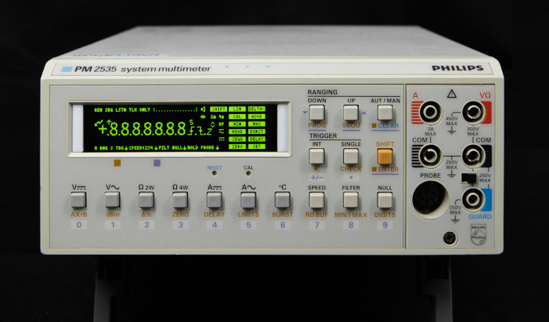

# Philips PM2535 - Kermit

Philips PM2525, PM2534, and PM2535 leaking LCD OLED display replacement.

## Prolog

Recently I acquired a Philips PM2535 system multimeter with slightly leaking LCD. The photo below shows how this
multimeter was advertised. The leakage was not really serious.

The multimeter system was sent to me amid chilly days and even colder nights. It seems the package endured a freezing
night inside a truck. When I extracted the multimeter from the box, it was so cold that it chilled my hands. The low
temperature visibly affected the LCD.

After allowing it to reach room temperature over the course of a day, there was no improvement in the LCD's condition.
Since I needed to examine the multimeter for potential internal issues like leaking capacitors, I opted to take apart
the LCD enclosure to investigate whether mechanical strain was the cause of the display problem. As it turned out, the
LCD was fitted very tight within its acrylic enclosure.

After reassembling the multimeter, the LCD looked like this.

Job well done! A definite improvement! A resounding success! An outstanding accomplishment! An unparalleled achievement!
Superb execution! Unmatched excellence!

[Tony Albus](https://www.youtube.com/watch?v=Mmr6-NKht3c&t=281s) made it look so easy to replace a display of a Philips
PM2534 Multimeter that I even could do it. BTW How did Tony obtain this piece of unobtainium?

But seriously, I would never have touched the LCD if I knew there isn't an alternative solution.

## Display Replacement

Luckily, before purchasing the multimeter and subsequently destroying its LCD, I did my homework and I knew there is an
alternative solution. EEVblog
contributors [Cowasaki](https://www.eevblog.com/forum/repair/philips-pm2525-alternative-lcd-display/)
and [Hackwell](https://www.eevblog.com/forum/testgear/fluke-pm2525pm2535-unobtainium-lcd-alternative/) found a way to
drive a suitable OLED display by tapping of the I2C signals to the LCD driver using an Arduino Nano. Checkout their
posts.

### OLED Display

[Hackwell](https://www.eevblog.com/forum/testgear/fluke-pm2525pm2535-unobtainium-lcd-alternative/) suggested using a
3.12" 256*64 OLED Display with a SSD1322 controller. Since the U8g2 library also supports the SSD1362 controller, I
ordered two displays with different controllers.

The white OLED display with a SSD1362 controller that I received turned out to be faulty, the half of the first 25% of
the columns are not working. Petty, this display requires minimal filing of the PCB to fit in the original acrylic
enclosure. Luckily, I got a refund.

The yellow OLED display equipped with a SSD1322 controller refused to cooperate. I feared that the elusive magic smoke
had been set free, and I had every reason to think so, especially after I mistakenly swapped the Vcc and GND pins.

Subsequently, I discovered that one of the jumpers on the rear was incorrectly set. Unaware of this at the time, I went
ahead and ordered a green OLED display featuring a SSD1322 controller, and it worked seamlessly right from the start.

### Circuit

The Philips PM2535 as one would expect from a product of its time has 5V TTL logic. In contrast, our Arduino Nano Every
and the OLED display operate on 3.3V logic. Additionally, the input ports of the Arduino Nano Every are not 5V tolerant.
Hence, we need a logic level shifter. Fortunately, these are readily available at affordable prices.

I measured that the OLED display requires about 100mA with all pixels on, and the Arduino Nano Every can supply 550mA
(recommended max 200mA) to external devices. So, we can power the OLED display directly from the Arduino Nano Every.

I tested the circuit and software on a breadboard.

To me, it felt mesmerizing to see two 6.5 multimeter displays showing the exact same value all the time.

### The long-legged pin header

The main board and the front assembly are connected by a flat cable with a 7-pin connector with very long legs. Does
anybody have seen a connector like this? The only connectors similar to this connector I could find
are [PC/104 connectors or headers](https://en.wikipedia.org/wiki/PC/104). Since the affordable suppliers don't carry
7-pin [PC/104 headers](https://en.wikipedia.org/wiki/PC/104), I had to remove one pin from a couple of 8-pin headers.

### Software

EEVblog contributor [Hackwell](https://www.eevblog.com/forum/profile/?u=421591) has published his software at
[GitHub](https://github.com/AKerambrun/PM2525-OLED-display). Well done.

I started off from his code and made the following changes:

* Refactored his code beyond recognition.
* Improved the layout of the elements on the display such that we utilize the full potential of our 256x64 display.
* I guess, improved the performance significantly. [Hackwell](https://www.eevblog.com/forum/profile/?u=421591) use in
  his code the `U8G2_SSD1322_NHD_256X64_1_4W_HW_SPI` constructor which uses a 256-byte buffer size, hence requires at
  least eight iterations (i.e. decoding the message from the multimeter and invoking the U8g2 library) to refresh the
  display. The `U8G2_SSD1322_NHD_256X64_F_4W_SW_SPI` constructor uses a full frame buffer, the message from the
  multimeter needs to be decoded once only, and the display is refreshed by a single call to the U8g2 library. Most
  likely, this is the cause of 'the bit slow update' that [Hackwell](https://www.eevblog.com/forum/profile/?u=421591)
  noticed at
  [README.md](https://github.com/AKerambrun/PM2525-OLED-display/blob/main/README.md).

It was fun to program in C++ again, after 20 years.

Of course, I published my software at [GitHub](https://github.com/MagicSmokeBlog/Philips-PM2535-Kermit) too.

You can compile the software by opening [Software/PM25XX_OLED/PM25XX_OLED.ino](Software/PM25XX_OLED/PM25XX_OLED.ino) in
Arduino IDE. You must install the U8g2 library.

### Hardware

We have done all the electrical and software engineering. Now it is time to do some hardware engineering and reassemble
Philips PM2535 System Multimeter. The OLED display does not fit in the front assembly of the multimeter, and there isn't
anything to mount the Arduino Nano Every on in the back of the multimeter. Therefore, I designed in OpenScad the
following items:

* An adaptor plate to glue the OLED display in the front assembly.
* A bracket that can be placed on the PCB in the front assembly hold by a single screw.

The next photo shows a surprise inspection by Ryzhyk of the iterations I went through during the design process.

Follow the instructions below for assembling all the parts.

#### Step 1: 3D Print the parts

The STL files are located under the [Mount](Mount) folder.

#### Step 2: Populate Matrix PCB

Assemble the Arduino Nano Every, logic level shifter, a JST-XH2.54 connector, and
a [PC/104 pin header](https://en.wikipedia.org/wiki/PC/104) on a piece of Matrix PCB. Note:

* Pin 20 of the Arduino Nano Every has been removed.
* The back size of the matrix PCB has been flipped.

#### Step 3: Assemble Baseplate

Insert M2*3*3.5 brass threaded insert nuts in the four standoffs, glue the M3*5*4 in brass threaded insert nut in the
baseplate, and glue the standoffs onto the baseplate.

The photo below shows the assembled prototype PCB with the Arduino Nano Every, the logic level shifter,
and [PC/104 pin headers](https://en.wikipedia.org/wiki/PC/104) mounted on the front PCB of the multimeter.

#### Step 4: Preparing the OLED Display

Remove the metal bezel from the OLED display module. This requires bending the "ends" of the metal bezel straight. Don't
worry, the OLED display is glued to the PCB.

Cut the pieces from the PCB of the OLED display module as shown in the photo below.

#### Step 5: Assembling the Front Assembly

Glue the 3D printed frame on the OLED display module. I applied hot glue as strain release for the flat cable, as well.

Hot glue the assembled frame and OLED display module in the front of the multimeter. Hot glue has the advantage that the
frame and OLED display module can be removed relatively easily in the future.

Tip: There is some play when placing the frame and OLED display module in the front of the multimeter. When powering the
Arduino and OLEd display from a USB port, you are able to align the display and front part of the multimeter perfectly,
especially when you compile the software in debug mode.

Reinsert the PCB back into the front assembly of the multimeter, and connect the JST-XH2.54 connectors.

#### Step 6: Reassembling the Multimeter

The [System Multimeter PM2534 PM2535 Service Manual](https://bama.edebris.com/download/philips/pm2534/PHILIPS%20PM2535-OM-last%20version.djvu)
contains details instructions about reassembling the multimeter.

The photo below shows how everything fits needly in the multimeter.

#### Step 7: 

Enjoy your Philips PM2535 System Multimeter. The result is shown in the first photo at this README.md.

## The Probe Plug

*Slightly diverging from the main topic, but I'd like to touch upon this subject.*

The infamous Philips probe plug, a thing of beauty is a joy forever. I hope, someday, someone, a former Philips
employee, tells the story what happened at Philips that made them decide to choose a DIN connector above standard banana
jacks. Was it a joke? Was it a management decision? Was it a trainee who messed up some documents? I am afraid we will
never know.

The probe plug is an 8-pin DIN connector, 8-pin DIN connectors come in two flavors:

* DIN IEC 601130-9, a.k.a. C-style, the common one.
* DIN IEC 60574-18, a.k.a. U-style, the obscure one.

Note the different order of pin numbering.

On the used measurement equipment marketplace, equipment comes seldom with their original leads and probes. So, most of
us are forced to acquire a replacement probe. When you order a circular 8-pin DIN plug anywhere in the world, you get a
C-style plug by default. Of course, Philips has chosen for the U-style (DIN IEC 60574-18) connector. Make sure you add
262 to your search query during your quest for the appropriate 8-pin DIN plug.

## Other Philips equipment with LCD

The Philips PM2525, PM2534, and PM2535 multimeter have (nearly) identical LCD layouts and all have a PCF8576 LCD driver.

Other Philips equipment with LCD are:

* PM2521: This automatic multimeter has three SAA1060 LED display drivers.
* PM2544: We don't have any information about this logic multimeter.

These meters have different LCD layout and have different LCD driver ICs; however, you can use this project as a
starting point for display replacements.

## Credits

* EEVblog contributor [Cowasaki](https://www.eevblog.com/forum/profile/?u=163718)
* EEVblog contributor [Hackwell](https://www.eevblog.com/forum/profile/?u=421591)
* Wikipedia contributor [Ancillalover](https://en.wikipedia.org/wiki/DIN_connector#/media/File:DIN_connector_pinout.svg)

## Resources

* [Fluke and Philips Test and Measurement Catalog 1992](https://www.petervis.com/archive/fluke-and-philips-test-and-measurement-1992/pm-2534-and-pm-2535.html)
* [The Boat Anchor Archive](https://bama.edebris.com/manuals/philips/pm2534/)
    * [System Multimeter PM2535 Operation Manual](https://bama.edebris.com/download/philips/pm2534/PHILIPS%20PM2534-35-SM.djvu)
    * [System Multimeter PM2534 PM2535 Service Manual](https://bama.edebris.com/download/philips/pm2534/PHILIPS%20PM2535-OM-last%20version.djvu)
* https://en.wikipedia.org/wiki/DIN_connector

### EEVblog

* https://www.eevblog.com/forum/repair/philips-pm2525-alternative-lcd-display/
* https://www.eevblog.com/forum/testgear/fluke-pm2525pm2535-unobtainium-lcd-alternative/
* https://www.eevblog.com/forum/repair/unobtainium-philips-pm2525-pm2534-and-pm2535-lcd-replacement/

### Software
* https://github.com/AKerambrun/PM2525-OLED-display
* https://github.com/olikraus/u8g2

### Datasheets

* https://www.nxp.com/docs/en/data-sheet/PCF8576.pdf
* https://pdf1.alldatasheet.com/datasheet-pdf/download/17579/PHILIPS/BZV14.html

# License

This project except for the software under the [Software](Software) folder is licensed under the terms
of [Creative Commons Attribution ShareAlike 4.0](LICENSE.new). The software under the [Software](Software) folder is
licensed under the terms of the GNU General Public License v3.0.
